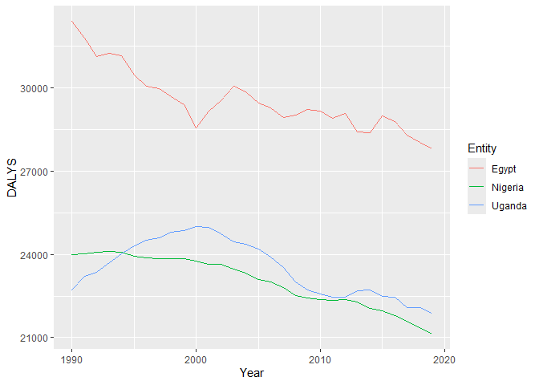

Global Disease Burden Analysis
================
Saifeldin Shehata and Sheila Wesonga
2024-04-20

# Introduction

This document compares the Disability-Adjusted Life Year (DALY) diseases
burden for three countries: Egypt, Nigeria and Uganda. We compare the
burden due to communicable, maternal, neonatal, and nutritional diseases
(CMNN), and non-communicable diseases (NCDs). Overall disease burden for
these countries is not included in this report.

The source data is from the Institute for Health Metrics and Evaluation
(IHME) Global Burden of Disease (GBD) study.

# Communicable, Maternal, Neonatal, and Nutritional Disease Burden (CMNN)

## Table of Estimates for CMNN Burden Over Time

| Year |     Egypt |  Nigeria |   Uganda |
|-----:|----------:|---------:|---------:|
| 1990 | 15982.187 | 55858.01 | 75944.97 |
| 1991 | 15174.754 | 56402.61 | 76978.02 |
| 1992 | 14329.643 | 55584.80 | 77511.61 |
| 1993 | 13525.261 | 55462.25 | 77695.11 |
| 1994 | 12701.540 | 55563.10 | 76948.73 |
| 1995 | 11991.788 | 55778.38 | 76070.29 |
| 1996 | 10992.916 | 56608.97 | 74909.36 |
| 1997 | 10312.442 | 55670.89 | 73726.62 |
| 1998 |  9765.039 | 55633.69 | 72243.52 |
| 1999 |  9235.311 | 55610.97 | 70524.46 |
| 2000 |  8670.003 | 55309.83 | 68550.38 |
| 2001 |  8252.112 | 54828.09 | 65942.75 |
| 2002 |  7865.883 | 53795.58 | 63032.73 |
| 2003 |  7594.373 | 52594.17 | 60345.84 |
| 2004 |  7257.179 | 50933.61 | 57778.01 |
| 2005 |  6962.288 | 49195.49 | 53612.07 |
| 2006 |  6674.542 | 47222.66 | 49145.64 |
| 2007 |  6420.688 | 45320.76 | 46258.95 |
| 2008 |  6094.775 | 43735.33 | 43621.19 |
| 2009 |  5836.421 | 42069.10 | 41071.17 |
| 2010 |  5474.202 | 40429.09 | 38831.56 |
| 2011 |  5215.897 | 38900.83 | 36196.78 |
| 2012 |  4912.603 | 37432.21 | 33312.56 |
| 2013 |  4702.594 | 36186.87 | 30292.27 |
| 2014 |  4454.244 | 35085.94 | 28099.68 |
| 2015 |  4508.470 | 33891.85 | 26900.48 |
| 2016 |  4151.404 | 32791.92 | 26645.55 |
| 2017 |  3960.252 | 31579.39 | 24668.12 |
| 2018 |  3789.875 | 30540.72 | 22896.94 |
| 2019 |  3641.496 | 29467.82 | 21904.64 |

## Plot Showing Trends in CMNN Burden Over Time

<!-- -->

## Summary of CMNN Burden Findings

Nigeria and Uganda have a high CMNN disease burden that both decreases
over time. Egypt has a 3-4 fold lower CMNN disease burden that also
decreases over time. The CMNN disease burden of Nigeria and Uganda
decreases at a higher rate than that of Egypt.

# Non-Communicable Disease Burden (NCD)

This data shows the NCD burden in Egypt, Nigeria and Uganda over time.

## Table of Estimates for NCD Burden Over Time

    ## # A tibble: 30 × 4
    ##     Year  Egypt Nigeria Uganda
    ##    <dbl>  <dbl>   <dbl>  <dbl>
    ##  1  1990 32401.  23994. 22728.
    ##  2  1991 31805.  24006. 23207.
    ##  3  1992 31146.  24073. 23368.
    ##  4  1993 31244.  24103. 23710.
    ##  5  1994 31168.  24068. 24026.
    ##  6  1995 30480.  23947. 24297.
    ##  7  1996 30075.  23875. 24516.
    ##  8  1997 29983.  23852. 24611.
    ##  9  1998 29685.  23845. 24812.
    ## 10  1999 29413.  23833. 24846.
    ## # ℹ 20 more rows

| Entity  | Code | Year |    DALYS |
|:--------|:-----|-----:|---------:|
| Egypt   | EGY  | 1990 | 32401.20 |
| Egypt   | EGY  | 1991 | 31805.29 |
| Egypt   | EGY  | 1992 | 31145.73 |
| Egypt   | EGY  | 1993 | 31244.21 |
| Egypt   | EGY  | 1994 | 31168.03 |
| Egypt   | EGY  | 1995 | 30479.68 |
| Egypt   | EGY  | 1996 | 30074.69 |
| Egypt   | EGY  | 1997 | 29982.56 |
| Egypt   | EGY  | 1998 | 29685.31 |
| Egypt   | EGY  | 1999 | 29413.31 |
| Egypt   | EGY  | 2000 | 28575.97 |
| Egypt   | EGY  | 2001 | 29164.16 |
| Egypt   | EGY  | 2002 | 29535.44 |
| Egypt   | EGY  | 2003 | 30062.47 |
| Egypt   | EGY  | 2004 | 29875.85 |
| Egypt   | EGY  | 2005 | 29452.96 |
| Egypt   | EGY  | 2006 | 29274.88 |
| Egypt   | EGY  | 2007 | 28933.01 |
| Egypt   | EGY  | 2008 | 29011.05 |
| Egypt   | EGY  | 2009 | 29231.84 |
| Egypt   | EGY  | 2010 | 29159.83 |
| Egypt   | EGY  | 2011 | 28909.63 |
| Egypt   | EGY  | 2012 | 29075.39 |
| Egypt   | EGY  | 2013 | 28423.00 |
| Egypt   | EGY  | 2014 | 28397.94 |
| Egypt   | EGY  | 2015 | 29000.65 |
| Egypt   | EGY  | 2016 | 28791.90 |
| Egypt   | EGY  | 2017 | 28294.43 |
| Egypt   | EGY  | 2018 | 28048.67 |
| Egypt   | EGY  | 2019 | 27807.15 |
| Nigeria | NGA  | 1990 | 23994.43 |
| Nigeria | NGA  | 1991 | 24005.55 |
| Nigeria | NGA  | 1992 | 24073.41 |
| Nigeria | NGA  | 1993 | 24103.21 |
| Nigeria | NGA  | 1994 | 24068.17 |
| Nigeria | NGA  | 1995 | 23947.07 |
| Nigeria | NGA  | 1996 | 23875.00 |
| Nigeria | NGA  | 1997 | 23852.26 |
| Nigeria | NGA  | 1998 | 23844.55 |
| Nigeria | NGA  | 1999 | 23833.43 |
| Nigeria | NGA  | 2000 | 23763.60 |
| Nigeria | NGA  | 2001 | 23631.43 |
| Nigeria | NGA  | 2002 | 23629.69 |
| Nigeria | NGA  | 2003 | 23472.64 |
| Nigeria | NGA  | 2004 | 23329.15 |
| Nigeria | NGA  | 2005 | 23101.87 |
| Nigeria | NGA  | 2006 | 23016.59 |
| Nigeria | NGA  | 2007 | 22813.20 |
| Nigeria | NGA  | 2008 | 22528.84 |
| Nigeria | NGA  | 2009 | 22435.62 |
| Nigeria | NGA  | 2010 | 22360.91 |
| Nigeria | NGA  | 2011 | 22343.36 |
| Nigeria | NGA  | 2012 | 22376.80 |
| Nigeria | NGA  | 2013 | 22276.31 |
| Nigeria | NGA  | 2014 | 22064.38 |
| Nigeria | NGA  | 2015 | 21964.47 |
| Nigeria | NGA  | 2016 | 21802.05 |
| Nigeria | NGA  | 2017 | 21594.53 |
| Nigeria | NGA  | 2018 | 21350.80 |
| Nigeria | NGA  | 2019 | 21141.61 |
| Uganda  | UGA  | 1990 | 22727.60 |
| Uganda  | UGA  | 1991 | 23206.69 |
| Uganda  | UGA  | 1992 | 23368.22 |
| Uganda  | UGA  | 1993 | 23709.61 |
| Uganda  | UGA  | 1994 | 24026.41 |
| Uganda  | UGA  | 1995 | 24297.30 |
| Uganda  | UGA  | 1996 | 24516.17 |
| Uganda  | UGA  | 1997 | 24611.35 |
| Uganda  | UGA  | 1998 | 24812.32 |
| Uganda  | UGA  | 1999 | 24845.58 |
| Uganda  | UGA  | 2000 | 24996.34 |
| Uganda  | UGA  | 2001 | 24965.22 |
| Uganda  | UGA  | 2002 | 24729.75 |
| Uganda  | UGA  | 2003 | 24456.48 |
| Uganda  | UGA  | 2004 | 24381.15 |
| Uganda  | UGA  | 2005 | 24180.73 |
| Uganda  | UGA  | 2006 | 23896.03 |
| Uganda  | UGA  | 2007 | 23518.92 |
| Uganda  | UGA  | 2008 | 23007.55 |
| Uganda  | UGA  | 2009 | 22711.37 |
| Uganda  | UGA  | 2010 | 22576.37 |
| Uganda  | UGA  | 2011 | 22459.96 |
| Uganda  | UGA  | 2012 | 22453.22 |
| Uganda  | UGA  | 2013 | 22702.08 |
| Uganda  | UGA  | 2014 | 22726.48 |
| Uganda  | UGA  | 2015 | 22494.26 |
| Uganda  | UGA  | 2016 | 22459.26 |
| Uganda  | UGA  | 2017 | 22080.32 |
| Uganda  | UGA  | 2018 | 22069.92 |
| Uganda  | UGA  | 2019 | 21890.06 |

## Plot Showing Trends in NCD Burden Over Time

<!-- -->

## Summary of NCD Burden Findings

Egypt appears to have a higher NCD burden over time compared to Nigeria
or Uganda.

# Overall Disease Burden

## Table of Estimates for Overall Disease Burden Over Time

## Plot Showing Trends in Overall Disease Burden Over Time

## Summary of Overall Disease Burden Findings

Provide a brief analysis based on the data presented in the table and
chart. Highlight any significant findings or patterns. About 3
sentences.
