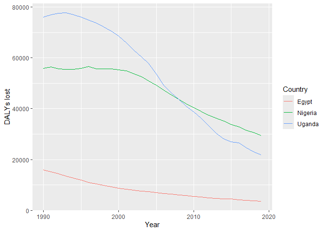

Disease burden for Egypt, Nigeria and Uganda between 1990 and 2019
================
Saifeldin Shehata
2024-04-17

# Communicable, Maternal, Neonatal, and Nutritional Disease Burden (CMNN)

## Table of Estimates for CMNN Burden Over Time

| Year |     Egypt |  Nigeria |   Uganda |
|-----:|----------:|---------:|---------:|
| 1990 | 15982.187 | 55858.01 | 75944.97 |
| 1991 | 15174.754 | 56402.61 | 76978.02 |
| 1992 | 14329.643 | 55584.80 | 77511.61 |
| 1993 | 13525.261 | 55462.25 | 77695.11 |
| 1994 | 12701.540 | 55563.10 | 76948.73 |
| 1995 | 11991.788 | 55778.38 | 76070.29 |
| 1996 | 10992.916 | 56608.97 | 74909.36 |
| 1997 | 10312.442 | 55670.89 | 73726.62 |
| 1998 |  9765.039 | 55633.69 | 72243.52 |
| 1999 |  9235.311 | 55610.97 | 70524.46 |
| 2000 |  8670.003 | 55309.83 | 68550.38 |
| 2001 |  8252.112 | 54828.09 | 65942.75 |
| 2002 |  7865.883 | 53795.58 | 63032.73 |
| 2003 |  7594.373 | 52594.17 | 60345.84 |
| 2004 |  7257.179 | 50933.61 | 57778.01 |
| 2005 |  6962.288 | 49195.49 | 53612.07 |
| 2006 |  6674.542 | 47222.66 | 49145.64 |
| 2007 |  6420.688 | 45320.76 | 46258.95 |
| 2008 |  6094.775 | 43735.33 | 43621.19 |
| 2009 |  5836.421 | 42069.10 | 41071.17 |
| 2010 |  5474.202 | 40429.09 | 38831.56 |
| 2011 |  5215.897 | 38900.83 | 36196.78 |
| 2012 |  4912.603 | 37432.21 | 33312.56 |
| 2013 |  4702.594 | 36186.87 | 30292.27 |
| 2014 |  4454.244 | 35085.94 | 28099.68 |
| 2015 |  4508.470 | 33891.85 | 26900.48 |
| 2016 |  4151.404 | 32791.92 | 26645.55 |
| 2017 |  3960.252 | 31579.39 | 24668.12 |
| 2018 |  3789.875 | 30540.72 | 22896.94 |
| 2019 |  3641.496 | 29467.82 | 21904.64 |

## Plot Showing Trends in CMNN Burden Over Time

<!-- -->

## Summary of CMNN Burden Findings

Nigeria and Uganda have a high CMNN disease burden that both decreases
over time. Egypt has a 3-4 fold lower CMNN disease burden that also
decreases over time. The CMNN disease burden of Nigeria and Uganda
decreases at a higher rate than that of Egypt.
